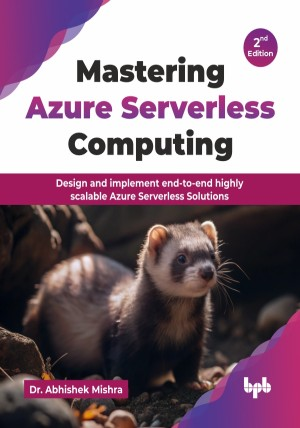

# Mastering Azure Serverless Computing - 2nd Edition

Design and implement end-to-end highly scalable Azure Serverless Solutions.

This is the repository for [Mastering Azure Serverless Computing- 2nd Edition
](https://bpbonline.com/products/mastering-azure-serverless-computing-2nd-edition),published by BPB Publications.

## About the Book
Mastering Azure Serverless Computing offers a modern approach to application development, enabling developers to build and deploy applications without managing infrastructure. This approach allows for faster development, greater scalability, and reduced operational costs.

This book is your guide to building agile and cost-effective cloud applications using Microsoft Azure's Serverless technologies. This updated edition expands core serverless concepts and services like Azure Functions, Azure Durable Functions, and Azure Logic Apps. New to this edition is comprehensive coverage of Azure Serverless Cosmos DB for globally distributed NoSQL applications and a dedicated exploration of containerized serverless deployments through Azure Serverless Kubernetes and the streamlined Azure Container Apps service. The book features completely revamped Azure Portal screenshots reflecting the latest interface. The concluding sections on designing and implementing serverless solutions have been significantly enhanced with detailed scenarios and a new, practical end-to-end implementation lab focused on a Customer Tweet Analysis application, solidifying your ability to architect real-world solutions. 

By the end of this book, you will be adept at leveraging the full spectrum of Azure Serverless Services. You will possess the practical skills to design, develop, and deploy highly scalable, cost-optimized, and innovative Serverless applications, equipped with the knowledge of the newest services and updated best practices in the Azure ecosystem.

## What You Will Learn
• Explore newly added Azure Serverless Cosmos DB for global NoSQL and foundational Azure Serverless Services.

• Learn to design and build Serverless containerized workloads on Azure using the newly introduced Azure Container Apps service.

• Design and implement practical Serverless solutions, benefiting from updated Azure Portal visuals and a new end-to-end Customer Tweet Analysis lab.

• Develop event-driven code with Azure Functions, mastering triggers and bindings.

• Orchestrate stateful Serverless workflows using Durable Functions' patterns.

• Design visual integration workflows with Azure Logic Apps' connectors and controls.

• Build reactive systems leveraging Azure Event Grid's event routing capabilities.

• Implement reliable asynchronous messaging with Azure Service Bus Queues and Topics.

• Deploy and manage containerized apps on Azure Serverless Kubernetes effectively.

